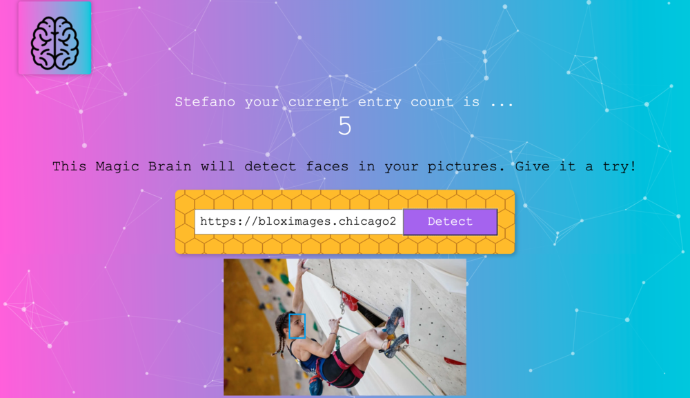

<h1># Smart Brain</h1>
https://dane-thesmartbrain.herokuapp.com

<h2>AI to detect faces in online pictures </h2>
<h3>SmartBrain is a full-stack web app</h3>

<h2>Introduction and Motivation </h2>
I developed this full-stach webapp as the final project of the 37-hours-long Web developer course ( https://www.udemy.com/course/the-complete-web-developer-zero-to-mastery/learn/lecture/19845426#overviewby Scrimba https://scrimba.com/ ) taught by Andrei Neagoie https://github.com/aneagoie founder of ZeroToMastery.
The application allows the users to paste an image URL in order to scan human faces inside the image.
Smart Brain runs on top an Artificial Intelligence technology provided by Clarifai https://www.clarifai.com. 

<h2>Technologies</h2>
<h3>Frontend</h3>
For the frontend, the application relies mostly on CSS3 and JSX due to the use of the REACT framework. 
On top of CSS3, I relied on Tachyons https://tachyons.io libraries for the SignIn and Register form.

<h3>Backend</h3>
https://github.com/SteRap/smart-brain-backend/

For the backend, I use NODE.js powered with EXPRESS.js. In addiction, I relied on few npm extensions: 1. BodyParser https://www.npmjs.com/package/body-parser as the middleware to enable the communication and data exchange between the frontend and the backend; 2. KNEX.js https://knexjs.org to powered Node.js and create better queries; 3. BCRYPT https://www.npmjs.com/package/bcrypt to encrypt users'passwords and guarentee security; 4. CORS https://www.npmjs.com/package/cors the package for providing the Express middleware that can be used to enable CORS with various options.
To test the server's requests I relied on Postman https://www.postman.com. 

<h3>Database</h3> 
To mantain the data for users'profile and for their entries' number, I use the relational database PostegreSQL. To work better with it, I relied on the database tool DBeaver https://dbeaver.io. On the matter, I structured the database by creating to tables: 1. Login 2. Users. They communicate between them through the common value (EMAIL). 

<h3>Hosting</h3>
Frontend, Backend and Database are all of them hosted by HEROKU https://www.heroku.com/home

<h2>Learnings</h2>  

Developing and working on this project has been as fun as tough. Completing this project, I acquire an enourmous amout of skills and knowledge. Now,  I feel much more confortable developping React app with class and functional components, dealing with React States, using React Hooks, performs fetch API and create a backend to serve a frontend app.

<h2>Credits</h2>

Huge thank is due to Andrei Neagoie https://github.com/aneagoie that released and taught an amazing and detailed course. All the topics have been introduced and explained clearly, and the Smart Brain app has been a great project to practice the taught knowledge and skills.

<h2>Contributions</h2>

If you are interested to contribute to this project, a couple of ideas are: 1. create frontend validation for Register and Sign In forms (so far validation is only on the server side); 2. Add section for the history of the entries. 

